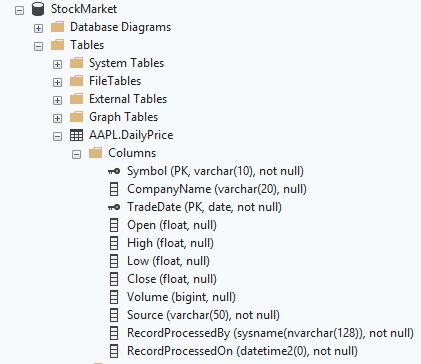

# oakland-apple-stock
A simple data engineering project for Oakland that retrieves Apple stock data from a Alpha Vantage, stores it in SQL Server, and displays the results.

## Project Overview

This project demonstrates a basic data ingestion pipeline using Python to retrieve Apple stock data and load it into SQL Server. The steps taken are as follows:

1. Retrieve Apple stock data from Alpha Vantage's API
2. Storing the stock data inside a dedicated database within SQL Server

## Table Layout

Below is a screenshot showing the structure used to store the Apple stock data. A new database called StockMarket was created, along with a schema named AAPL, which represents the stock symbol for Apple. The approach taken is to create a separate schema for each stock where required. While it would also be possible to store multiple stocks in the same table with a symbol column to distinguish them, this design allows for more granular permission control at the schema level if needed.

