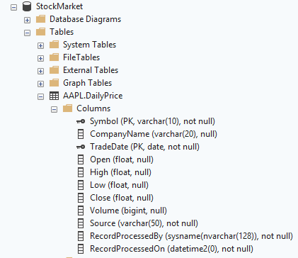
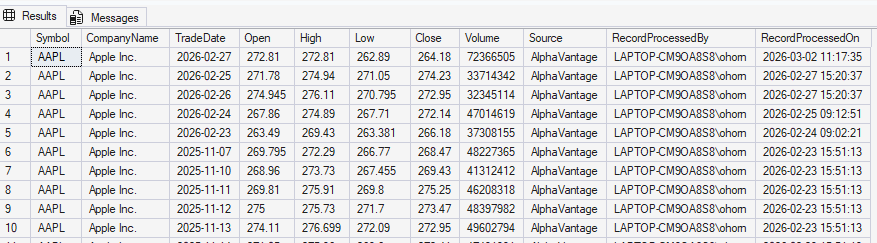
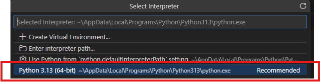
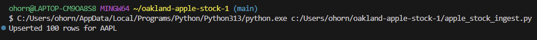

# oakland-apple-stock
A simple data engineering project for Oakland that retrieves Apple stock data from Alpha Vantage, stores it in SQL Server, and displays the results.

## Project Overview

This project demonstrates a basic data ingestion pipeline using Python to retrieve Apple stock data and load it into SQL Server. The steps taken are as follows:

1. Retrieving Apple stock data from Alpha Vantage's API
2. Storing the stock data inside a dedicated database within SQL Server
3. Building an API endpoint to validate the retrieval of data
4. Documenting the steps to support end-to-end deployment

## Table Layout

Below is a screenshot showing the structure used to store the Apple stock data. A new database called StockMarket was created, along with a schema named AAPL, which represents the stock symbol for Apple. The approach taken is to create a separate schema for each stock where required. While it would also be possible to store multiple stocks in the same table with a symbol column to distinguish them, this design allows for more granular permission control at the schema level if needed.

## Schema

The SQL script used to create the table can be found [here](create_stock_table.sql).

The table stores one record per trading day for Apple (AAPL). Its purpose is to provide a high-level view of daily stock performance.

| Name | Description | Data Type | Notes |
|------|-------------|-----------|-------|
| Symbol | Stock symbol (AAPL for Apple Inc.) | varchar(10) |  |
| CompanyName | Company name | varchar(20) | Default value set to "Apple Inc." |
| TradeDate | Trading date | date | One row per trading day |
| Open | Opening price | float | Data type was chosen as it is suitable for continuously changing numerical data |
| High | Highest price | float | Data type was chosen as it is suitable for continuously changing numerical data |
| Low | Lowest price | float | Data type was chosen as it is suitable for continuously changing numerical data |
| Close | Closing price | float | Data type was chosen as it is suitable for continuously changing numerical data |
| Volume | Number of shares traded | bigint | Data type was chosen as it can safely handle high numbers without risk of overflow |
| Source | Data source | varchar(50) | Default value set to "AlphaVantage" |
| RecordProcessedBy | SQL username | sysname | Auto populated to track who/what inserted or upserted the data |
| RecordProcessedOn | Processing timestamp | datetime2 | UTC timestamp of insert/upsert event |

The composite primary key on Symbol and TradeDate ensures that only one record exists for each stock on a given trading day, helping prevent duplicates and maintain data integrity.

This table structure was chosen to keep the design simple by focusing on a single stock. It supports efficient data ingestion, straightforward querying, and reliable upsert logic. If the solution were expanded to include additional stocks, it could either introduce separate schemas and tables per stock or modify the existing table to accommodate multiple symbols.

## Displaying the Data

I was initially unfamiliar with building out an API endpoint to display the data from SQL. To support this and my development, I used AI for inspiration and guidance to assist with implementing the solution. The endpoint returns the previous 10 days of stock data and can be accessed [here](http://127.0.0.1:5000/prices/latest).

## Stored Stock Data

After the process runs, the Apple stock data is stored in the DailyPrice table with each row representing one trading day and contains the high level metrics from that day.

The table also captures processing metadata, which identifies the SQL user that executed process, and records the date and time the data was processed. This could be adapted to update the RecordProcessedOn value for any trading days where the data changes historically, ensuring the timestamp always reflects the most recent update for that record.

Below is an example of the data stored in the table:

## Instructions

#### Prerequisites

Before starting, ensure your environment is configured with the following:
  -  Visual Studio Code (VSC) and Python installed on your machine.
  -  The Python extension enabled within VSC.

These instructions guide you through executing the Python script to upsert the latest stock data into the DailyPrice table. This guide assumes the table has already been initialised and all prerequisites are met.

1. Open Visual Studio Code
2. Press Ctrl, Shift and P on your keyboard
3. Select 'Python: Select Interpreter'
4. Select the recommended option as shown in the screengrab below
   
5. Run the Python script - it can be found [here](apple_stock_ingest.py) 
   5a. If 'requests' or 'pyodbc' is not recognised (usually with a red underlined squiggle), run the following code(s) in         Bash: 
     <b>python -m pip install requests 
     python -m pip install pyodbc</b>
6. Run the script. The following message will appear in the terminal:
    
7. To verify the update, you can check for today’s entries directly in SQL Server Management Studio (SSMS) or execute this [code](sql_validation.sql). A successful insertion will return a value of 1.
